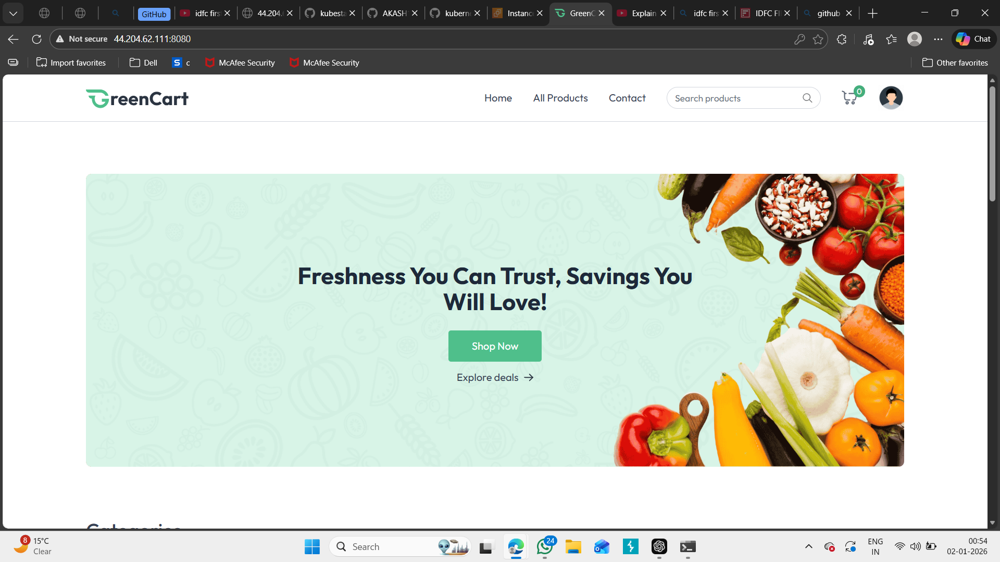
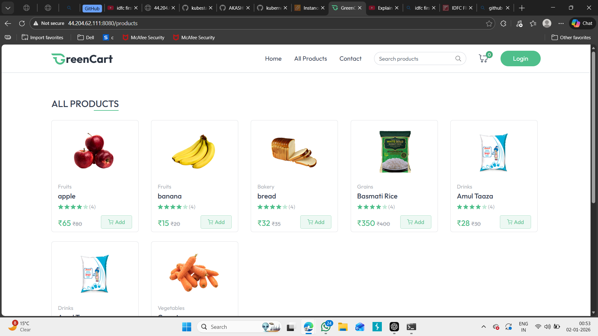
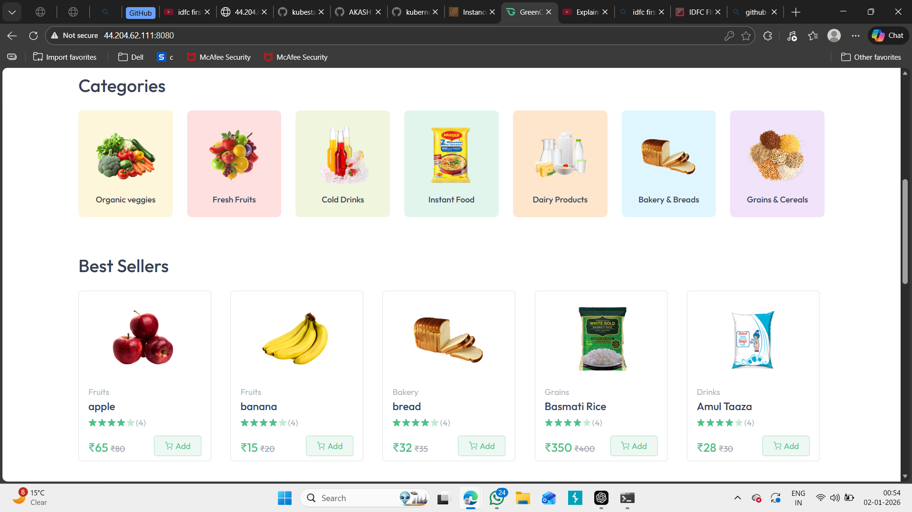
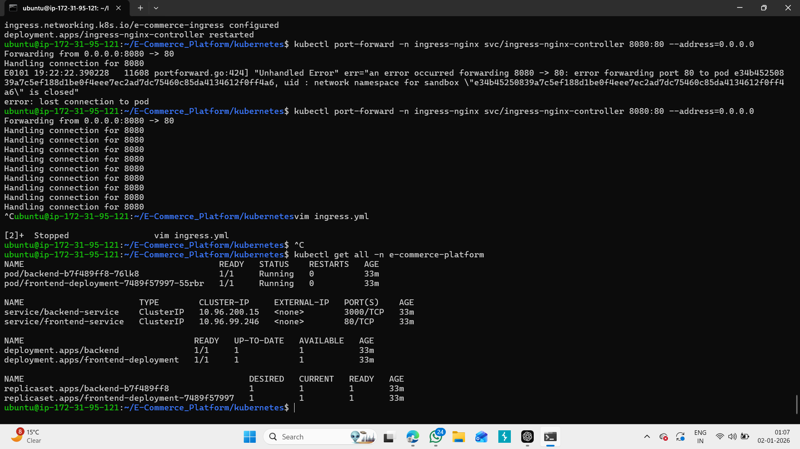

🛒 GreenCart – Cloud-Native E-Commerce Platform

GreenCart is a full-stack cloud-native e-commerce application deployed on Kubernetes using modern DevOps and cloud technologies.
It supports product browsing, authentication, cart management, and order processing through a microservice-based architecture.

🚀 Tech Stack

Frontend ,React.js ,Nginx ,Docker ,Backend , Node.js , Express , MongoDB Atlas

DevOps & Cloud - Docker ,Kubernetes ,NGINX Ingress Controller ,AWS EC2

Kubernetes Secrets & ConfigMaps

🏗 Architecture
User Browser
     |
     v
NGINX Ingress Controller (Port 8080)
     |
     ├── Frontend Service (React + Nginx)
     |
     └── Backend Service (Node.js API on Port 3000)
                  |
                  └── MongoDB Atlas (Cloud Database)

Ingress routes:

/ → Frontend

/api/* → Backend APIs

🌐 Live Features

Product listing

Categories (Fruits, Vegetables, Dairy, Bakery, Grains)

User authentication

Shopping cart

Responsive UI

📸 Application Screenshots

Add these screenshots inside a folder called /screenshots in your GitHub repo.

Then use this format:

## 🖥 Home Page

## 🛍 Products Page

## 📦 Categories

## Services

(U
